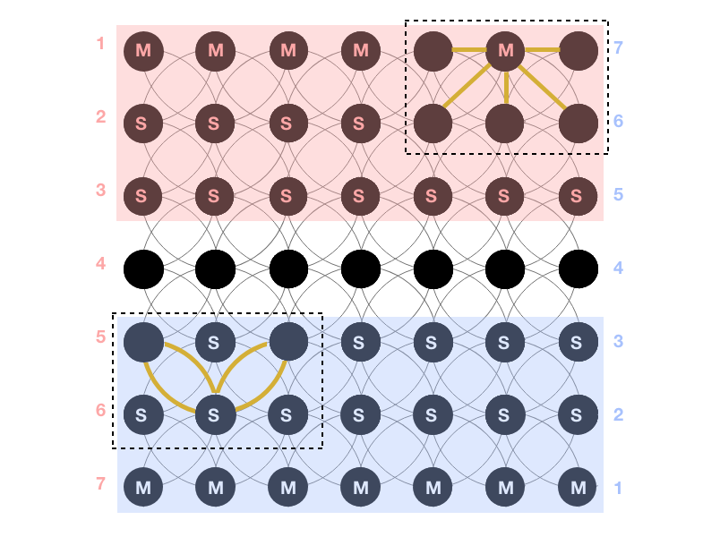
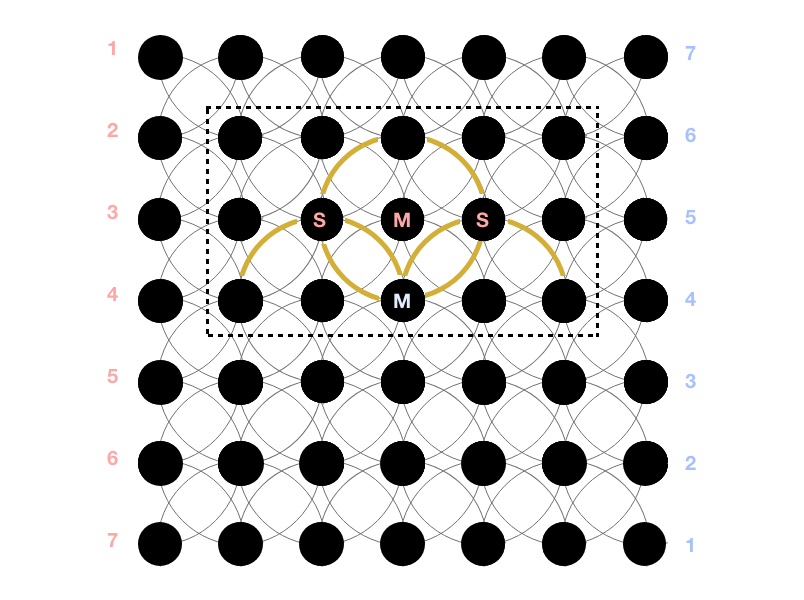

# Chakra View - A terminal game

'Chakra View' is a board game designed by IIT Bombay students and marketed by Funskool. This is a playble terminal version of the entire multiplayer game with all of its objectives, setup and rules.

## Rules
Following are the rules set by the game designers.

### Objective
The objective of the game is to have maximum number of Mantri Pawns on the 'First Line' of opponent player's zone.

### Game Board Setup
The board is divided into 3 areas: Zone 1, Zone 2 and Center line. Each player places their respective Mantri Pawn on the First Line and Soldier Pawns on line 2 and 3.

Each dot acts as a centre of a circle which forms a ChakraView. The curved lines connecting the dots serve as pathways for the Soldier and Mantri Pawns.

### Moves
A **Soldier Pawn** can be used to make pathways clear for his Mantri Pawns to reach their destination. They can also tactically block the opponent player's path. The Soldier Pawns can move ONLY diagonally to move to the next dot.  

The objective of **Mantri Pawn** is to move into opponent's First Line. They can either follow Solider Pawn's path or can move to the nearest dot sideways, vertically or horizontally.  
No Pawn cannot move backwards at all. Mantri and Soldier can take only one step at a time except during Elimination.

### Elimination
A Solider or Mantri can be eliminated only when they are in the centre of a circle and the opponent player's Soldier or Mantri is on periphery of the same circle. If so, the opponent player can move 2 arcs in a semi circle to reach the opposite side subject to the opponents side of circle unoccupied/vacant.

When an opponent players Soldier or Mantri pawn is successfully eliminated, remove the Pawn from the board and get an Extra Turn to play.

#### Injuring a Soldier
The battle gets exciting as Soldier Pawns can be injured during Elimination process, when that Soldier is on the elimination path.

If a Soldier Pawn reaches the First Line of the opponent, it can be replaced by any of the eliminated Mantri Pawns. If none of the Mantri Pawns are eliminated, the Soldier Pawn remains in the same position until it is replaced by the Mantri Pawn.

---
## Setup

Although the game is ready to run, to get a "full, emmersive experience", check whether the function to clear the screen suits your OS.

### For Linux
Linux based system use `std::system("clear")` to clear your terminal screen from cpp code. This code was originaly built using a Linux based system and should work "out of the box".

### For Windows
Windows based system use `std::system("cls")` to clear your terminal screen from cpp code. To make this change, simply, open the code in any text editor, search for `"clear"` and replace it with `"cls"`. There should be 2 places to change.

## Usage

Step 1: Compile the source code  
`g++ ChakraView.cpp -o play`

Step 2: Get a friend to Play  
`./play`

Enjoy your battle. **Remember, the board rotates!**
